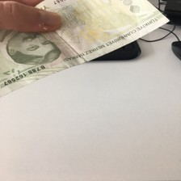
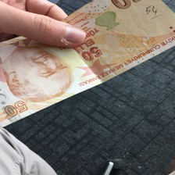
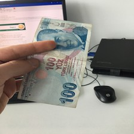
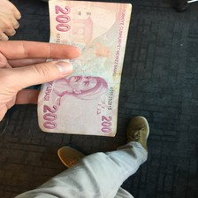
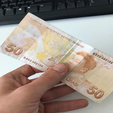
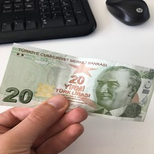

# Turkish Banknote Dataset

### Dataset Preview:

||||||
|:-:|:-:|:-:|:-:|:-:|
|0|1|2|3|4|
||||||
|5|6|7|8|9|

### Details of datasets:
- Image size: 224 x 224 pixels
- Color space: RGB
- Number of classes: 6 
- Train: 720, Test: 180 images
